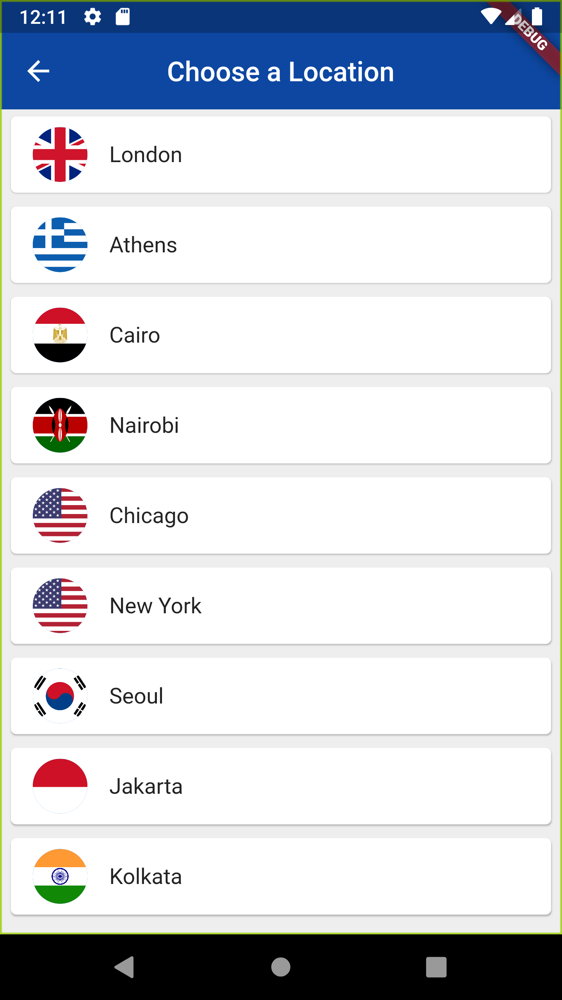
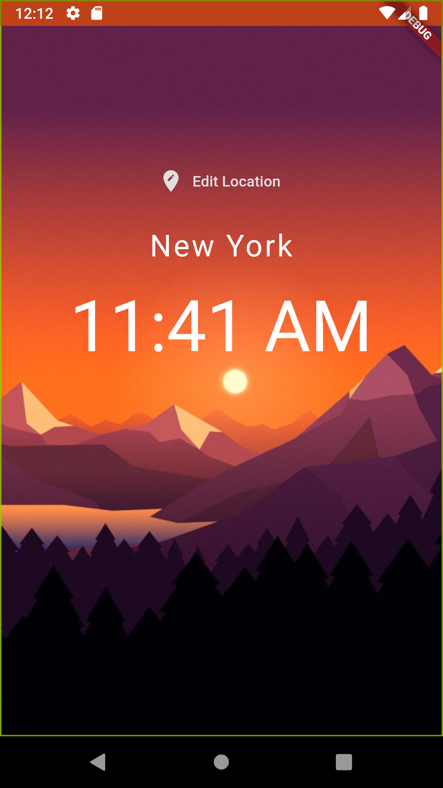
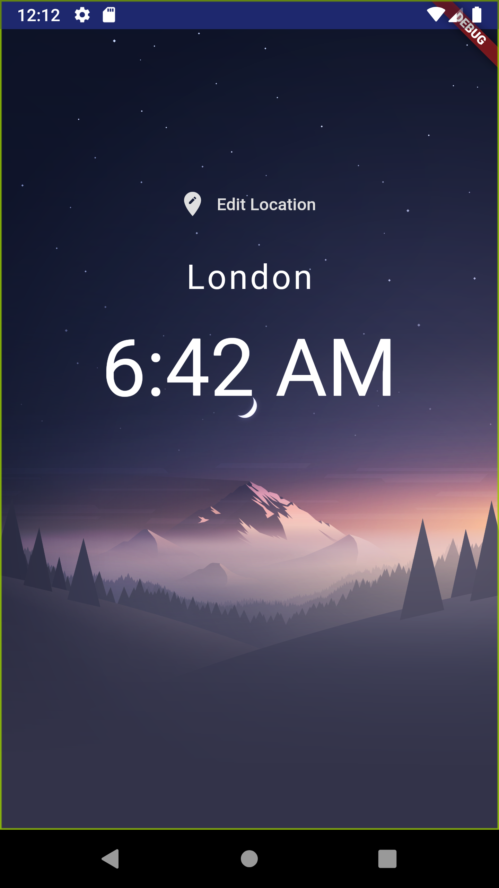

# world_time

A Flutter App showing time of certain locations.

## Problem 
Not a problem just another app doing the same.
<!--

## Packages used
  
  - [firebase_auth](https://pub.dev/packages/firebase_auth)
  - [cloud_firestore](https://pub.dev/packages/cloud_firestore)
  - [flutter_spinkit](https://pub.dev/packages/flutter_spinkit) 
 -->

### Screenshots
  
  

  
  
  

